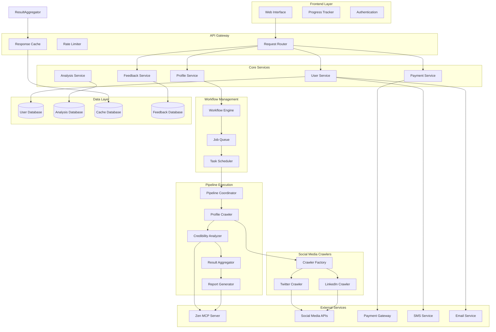

# Design Document

## Overview

Credi is a web-based social media credibility analysis platform built on a two-tier multi-agent architecture. The system processes social media profiles through specialized AI agents that evaluate content against eight credibility criteria, generating comprehensive reports with 0-10 credibility scores. The platform implements a freemium model with guest previews, user accounts, credit systems, and referral programs.

## Architecture

### High-Level Architecture



### Workflow Management Architecture

**Async Workflow Engine**

- Manages long-running analysis workflows (up to 3 minutes)
- Handles workflow state persistence and recovery
- Provides real-time progress updates to users
- Implements timeout and retry logic
- Supports workflow cancellation and cleanup

**Job Queue System**

- Queues analysis requests for processing
- Implements priority-based scheduling (paid users vs free users)
- Handles rate limiting and load balancing
- Provides job status tracking and monitoring
- Supports delayed job execution and retries

### Sequential Pipeline Architecture

The analysis workflow is a straightforward sequential pipeline where each stage processes the output of the previous stage. This eliminates the need for complex agent orchestration in favor of a simpler, more predictable flow.

**Analysis Pipeline Stages:**

1. **Profile Crawler**: Takes profile URL → Returns posts and metadata
2. **Credibility Analyzer**: Takes posts + profile info → Returns credibility assessment
3. **Result Aggregator**: Takes raw analysis → Returns structured result
4. **Report Generator**: Takes structured result → Returns formatted report

**Pipeline Coordinator**

- Manages workflow state and progress tracking
- Executes pipeline stages in sequence
- Handles errors and retries at each stage
- Provides real-time progress updates to users
- Implements timeout and cancellation logic

This approach is simpler, more testable, and easier to debug than a multi-tier agent system while still maintaining clear separation of concerns between specialized components.

## Components and Interfaces

### Frontend Components

**Authentication System**

```typescript
interface AuthService {
  registerUser(email: string, phone: string): Promise<RegistrationResult>;
  verifyEmail(token: string): Promise<boolean>;
  verifyPhone(code: string): Promise<boolean>;
  login(credentials: LoginCredentials): Promise<AuthResult>;
  logout(): Promise<void>;
}
```

**Profile Analysis Interface**

```typescript
interface AnalysisRequest {
  profileUrl: string;
  userId?: string;
  isGuest: boolean;
}

interface AnalysisProgress {
  stage: 'validation' | 'crawling' | 'analyzing' | 'scoring' | 'reporting';
  message: string;
  progress: number;
}

interface ProfilePreview {
  platform: 'twitter' | 'linkedin';
  username: string;
  displayName: string;
  profileTitle: string;
  isPublic: boolean;
}
```

**Credit Management**

```typescript
interface CreditService {
  getUserCredits(userId: string): Promise<number>;
  deductCredit(userId: string, analysisId: string): Promise<boolean>;
  addCredits(
    userId: string,
    amount: number,
    source: 'purchase' | 'referral'
  ): Promise<void>;
  processPayment(
    userId: string,
    package: CreditPackage
  ): Promise<PaymentResult>;
}
```

**Feedback Collection**

```typescript
interface FeedbackService {
  submitFeedback(feedback: FeedbackSubmission): Promise<FeedbackResult>;
  getFeedback(filters?: FeedbackFilters): Promise<Feedback[]>;
  updateFeedbackStatus(id: string, status: FeedbackStatus): Promise<void>;
}

interface FeedbackSubmission {
  type: 'bug' | 'feature' | 'general';
  title: string;
  description: string;
  userId?: string;
  userEmail?: string;
  browserInfo?: string;
  currentUrl?: string;
}
```

### Core Service Interfaces

**Profile Service**

```typescript
interface ProfileService {
  validateUrl(url: string): Promise<ValidationResult>;
  extractProfileInfo(url: string): Promise<ProfilePreview>;
  checkCache(profileUrl: string): Promise<CachedResult | null>;
  initiateAnalysis(request: AnalysisRequest): Promise<AnalysisSession>;
}
```

### Social Media Crawler Architecture

**Polymorphic Crawler Interface**

```typescript
interface SocialMediaCrawler {
  platform: 'twitter' | 'linkedin' | 'youtube';
  validateUrl(url: string): boolean;
  extractProfileInfo(url: string): Promise<ProfileInfo>;
  crawlPosts(profileUrl: string, limit: number): Promise<Post[]>;
  isProfilePublic(url: string): Promise<boolean>;
}

interface Post {
  id: string;
  content: string;
  timestamp: Date;
  links: string[];
}

interface ProfileInfo {
  username: string;
  displayName: string;
  bio: string;
  verified: boolean;
}
```

**Platform-Specific Implementations**

```typescript
class TwitterCrawler implements SocialMediaCrawler {
  platform = 'twitter' as const;

  validateUrl(url: string): boolean {
    return /^https?:\/\/(www\.)?(twitter\.com|x\.com)\/[a-zA-Z0-9_]+\/?$/.test(
      url
    );
  }

  async extractProfileInfo(url: string): Promise<ProfileInfo> {
    // Twitter-specific API calls or scraping logic
  }

  async crawlPosts(profileUrl: string, limit: number): Promise<Post[]> {
    // Twitter-specific post extraction

    import { ApifyClient } from 'apify-client';

    // Initialize the ApifyClient with API token
    const client = new ApifyClient({
      token: '<YOUR_API_TOKEN>',
    });

    // Prepare Actor input
    const input = {
      profileUrls: [
        'https://x.com/ishowspeedsui',
        'https://x.com/AshtonHallofc',
      ],
      resultsLimit: 30,
    };

    (async () => {
      // Run the Actor and wait for it to finish
      const run = await client.actor('Fo9GoU5wC270BgcBr').call(input);

      // Fetch and print Actor results from the run's dataset (if any)
      console.log('Results from dataset');
      const { items } = await client.dataset(run.defaultDatasetId).listItems();
      items.forEach((item) => {
        console.dir(item);
      });
    })();
    /*

    Example input: 
    {
        "profileUrls": [
            "https://x.com/elonmusk"
        ],
        "resultsLimit": 20
    }

    Example output:
    {
        "postText": "🦾🔥",
        "postUrl": "https://x.com/elonmusk/status/1938336472253534273",
        "profileUrl": "https://x.com/elonmusk",
        "timestamp": 1750970402000,
        "conversationId": "1938336472253534273",
        "postId": "1938336472253534273",
        "media": [],
        "author": {
            "name": "Elon Musk",
            "screenName": "elonmusk",
            "followersCount": 221266053,
            "favouritesCount": 153129,
            "friendsCount": 1146,
            "description": ""
        },
        "replyCount": 1558,
        "quoteCount": 50,
        "repostCount": 954,
        "favouriteCount": 9609
    }
    */
  }

  async isProfilePublic(url: string): Promise<boolean> {
    // Twitter-specific public profile check
  }
}

class LinkedInCrawler implements SocialMediaCrawler {
  platform = 'linkedin' as const;

  validateUrl(url: string): boolean {
    return /^https?:\/\/(www\.)?linkedin\.com\/in\/[a-zA-Z0-9-]+\/?$/.test(url);
  }

  async extractProfileInfo(url: string): Promise<ProfileInfo> {
    // LinkedIn-specific API calls or scraping logic
  }

  async crawlPosts(profileUrl: string, limit: number): Promise<Post[]> {
    import { ApifyClient } from 'apify-client';
    // Use the Apify client below for Crawling linkedin posts
    // Initialize the ApifyClient with API token
    const client = new ApifyClient({
      token: '<YOUR_API_TOKEN>',
    });

    // Prepare Actor input
    const input = {
      username: 'satyanadella',
      page_number: 1,
      limit: 100,
    };

    (async () => {
      // Run the Actor and wait for it to finish
      const run = await client.actor('LQQIXN9Othf8f7R5n').call(input);

      // Fetch and print Actor results from the run's dataset (if any)
      console.log('Results from dataset');
      const { items } = await client.dataset(run.defaultDatasetId).listItems();
      items.forEach((item) => {
        console.dir(item);
      });
    })();

    /*
        {
  "success": true,
  "message": "response retrieved successfully",
  "data": {
    "posts": [
      {
        "urn": "7123456789012345678",
        "full_urn": "urn:li:ugcPost:7123456789012345678",
        "posted_at": {
          "date": "2025-05-15 14:30:20",
          "relative": "2 days ago • Visible to anyone on or off LinkedIn",
          "timestamp": 1745678901234
        },
        "text": "Sample post text content. This is where the LinkedIn post text appears.",
        "url": "https://www.linkedin.com/posts/username_sample-activity-7123456789012345678-AbCd",
        "post_type": "regular",
        "author": {
          "first_name": "John",
          "last_name": "Doe",
          "headline": "CEO at Example Company",
          "username": "johndoe",
          "profile_url": "https://www.linkedin.com/in/johndoe",
          "profile_picture": "https://media.licdn.com/dms/image/profile-pic.jpg"
        },
        "stats": {
          "total_reactions": 123,
          "like": 100,
          "support": 5,
          "love": 10,
          "insight": 3,
          "celebrate": 5,
          "comments": 15,
          "reposts": 7
        },
        "media": {
          "type": "image",
          "url": "https://media.licdn.com/dms/image/sample-image.jpg",
          "thumbnail": "https://media.licdn.com/dms/image/sample-thumbnail.jpg"
        }
      }
    ],
    "pagination_token": "dXJuOmxpOmFjdGl2aXR5Ojc1MjM0NTU1NTU1NTU1NTU1NTUtMTc0NDc3ODkwMTIzNA=="
  }
}
        */
  }

  async isProfilePublic(url: string): Promise<boolean> {
    // LinkedIn-specific public profile check
  }
}
```

**Crawler Factory**

```typescript
class CrawlerFactory {
  private crawlers: Map<string, SocialMediaCrawler> = new Map();

  constructor() {
    this.crawlers.set('twitter', new TwitterCrawler());
    this.crawlers.set('linkedin', new LinkedInCrawler());
    // Future: this.crawlers.set('youtube', new YouTubeCrawler())
  }

  getCrawler(url: string): SocialMediaCrawler | null {
    for (const [platform, crawler] of this.crawlers) {
      if (crawler.validateUrl(url)) {
        return crawler;
      }
    }
    return null;
  }

  getSupportedPlatforms(): string[] {
    return Array.from(this.crawlers.keys());
  }
}
```

**Analysis Service**

```typescript
interface AnalysisService {
  processProfile(profileUrl: string): Promise<AnalysisResult>;
  getAnalysisStatus(sessionId: string): Promise<AnalysisProgress>;
  getCachedAnalysis(profileUrl: string): Promise<AnalysisResult | null>;
  saveAnalysis(result: AnalysisResult): Promise<void>;
}
```

### Workflow Management Interfaces

**Workflow Engine**

```typescript
interface WorkflowEngine {
  startAnalysisWorkflow(request: AnalysisRequest): Promise<WorkflowExecution>;
  getWorkflowStatus(executionId: string): Promise<WorkflowStatus>;
  cancelWorkflow(executionId: string): Promise<void>;
  retryWorkflow(executionId: string): Promise<WorkflowExecution>;
}

interface WorkflowExecution {
  id: string;
  status: 'running' | 'completed' | 'failed' | 'cancelled';
  progress: WorkflowProgress;
  result?: AnalysisResult;
  error?: string;
  startedAt: Date;
  completedAt?: Date;
}

interface WorkflowProgress {
  currentStage:
    | 'validation'
    | 'crawling'
    | 'analyzing'
    | 'reporting'
    | 'complete';
  stageProgress: number; // 0-100
  overallProgress: number; // 0-100
  message: string;
  estimatedTimeRemaining?: number;
}
```

**Job Queue System**

```typescript
interface JobQueue {
  enqueue(job: AnalysisJob): Promise<string>;
  dequeue(): Promise<AnalysisJob | null>;
  getJobStatus(jobId: string): Promise<JobStatus>;
  updateJobProgress(jobId: string, progress: JobProgress): Promise<void>;
  completeJob(jobId: string, result: any): Promise<void>;
  failJob(jobId: string, error: string): Promise<void>;
}

interface AnalysisJob {
  id: string;
  userId?: string;
  profileUrl: string;
  priority: 'low' | 'normal' | 'high';
  isGuest: boolean;
  createdAt: Date;
  maxRetries: number;
  currentRetry: number;
  timeout: number;
}

interface JobStatus {
  id: string;
  status: 'queued' | 'processing' | 'completed' | 'failed' | 'cancelled';
  progress?: JobProgress;
  result?: any;
  error?: string;
  queuePosition?: number;
  estimatedStartTime?: Date;
}

interface JobProgress {
  stage: string;
  progress: number;
  message: string;
  updatedAt: Date;
}
```

### Content Analyzer Agent Architecture

The Content Analyzer Agent uses the zen-mcp-server's consensus tool to get multi-model analysis of social media profiles. This approach leverages multiple AI models in parallel to analyze all posts and criteria simultaneously, then aggregates their responses for a final credibility assessment.

**Content Analyzer Using Zen MCP Consensus**

```typescript
interface ContentAnalyzerAgent {
  analyzeProfile(
    posts: Post[],
    profileInfo: ProfileInfo
  ): Promise<AnalysisResult>;
}

class ZenConsensusAnalyzer implements ContentAnalyzerAgent {
  constructor(
    private zenMCPClient: ZenMCPClient,
    private promptTemplate: string = process.env.CREDI_ANALYSIS_PROMPT || ''
  ) {}

  async analyzeProfile(
    posts: Post[],
    profileInfo: ProfileInfo
  ): Promise<AnalysisResult> {
    const analysisPrompt = this.buildAnalysisPrompt(posts, profileInfo);

    // Use zen consensus tool with multiple models
    const consensusResult = await this.zenMCPClient.consensus({
      prompt: analysisPrompt,
      models: [
        { model: 'claude-3-sonnet', stance: 'neutral' },
        { model: 'gpt-4', stance: 'neutral' },
        { model: 'gemini-pro', stance: 'neutral' },
      ],
      focus_areas: ['credibility', 'evidence', 'bias_detection'],
      thinking_mode: 'medium',
      temperature: 0.2,
    });

    return this.parseConsensusResult(consensusResult, posts, profileInfo);
  }

  private buildAnalysisPrompt(posts: Post[], profileInfo: ProfileInfo): string {
    if (!this.promptTemplate) {
      throw new Error('CREDI_ANALYSIS_PROMPT environment variable is required');
    }

    // Replace template variables with actual data
    return this.promptTemplate
      .replace('{{username}}', profileInfo.username)
      .replace('{{displayName}}', profileInfo.displayName)
      .replace('{{bio}}', profileInfo.bio)
      .replace('{{verified}}', profileInfo.verified.toString())
      .replace('{{postCount}}', posts.length.toString())
      .replace('{{posts}}', this.formatPosts(posts));
  }

  private formatPosts(posts: Post[]): string {
    return posts
      .map(
        (post, i) => `
Post ${i + 1} (${post.timestamp}):
${post.content}
${post.links.length > 0 ? 'Links: ' + post.links.join(', ') : ''}
`
      )
      .join('\n');
  }

  private parseConsensusResult(
    consensusResult: any,
    posts: Post[],
    profileInfo: ProfileInfo
  ): AnalysisResult {
    // Parse the consensus response and convert to AnalysisResult format
    // The zen consensus tool will provide aggregated analysis from multiple models

    return {
      id: generateId(),
      profileUrl: '', // Will be set by caller
      platform: this.detectPlatform(profileInfo.username),
      username: profileInfo.username,
      createdAt: new Date(),
      expiresAt: new Date(Date.now() + 24 * 60 * 60 * 1000), // 24 hours

      overview: {
        sampledPosts: posts.length,
        crediScore: consensusResult.finalScore || 5,
        focusAreas: this.extractFocusAreas(consensusResult),
      },

      strengths: this.extractStrengths(consensusResult),
      criteriaEvaluation: this.extractCriteriaEvaluation(consensusResult),
      representativePosts: this.extractRepresentativePosts(
        consensusResult,
        posts
      ),
      scoreJustification: this.extractJustification(consensusResult),
    };
  }
}
```

**Zen MCP Client Interface**

```typescript
interface ZenMCPClient {
  consensus(params: ConsensusParams): Promise<ConsensusResponse>;
}

interface ConsensusParams {
  prompt: string;
  models: Array<{
    model: string;
    stance?: 'for' | 'against' | 'neutral';
    stance_prompt?: string;
  }>;
  focus_areas?: string[];
  thinking_mode?: 'minimal' | 'low' | 'medium' | 'high' | 'max';
  temperature?: number;
  use_websearch?: boolean;
}

interface ConsensusResponse {
  finalScore: number;
  confidence: number;
  modelResponses: Array<{
    model: string;
    analysis: any;
    score: number;
  }>;
  consensus: string;
  reasoning: string;
}
```

**Environment Variable Configuration**

```typescript
interface PromptConfig {
  analysisPrompt: string;
  criteriaPrompts: Record<string, string>;
  scoringPrompt: string;
}

class PromptManager {
  private config: PromptConfig;

  constructor() {
    this.config = {
      analysisPrompt: process.env.CREDI_ANALYSIS_PROMPT || '',
      criteriaPrompts: {
        unnecessaryComplexity: process.env.CREDI_COMPLEXITY_PROMPT || '',
        proprietarySelling: process.env.CREDI_SELLING_PROMPT || '',
        usVsThemFraming: process.env.CREDI_FRAMING_PROMPT || '',
        overselling: process.env.CREDI_OVERSELLING_PROMPT || '',
        emotionOverData: process.env.CREDI_EMOTION_PROMPT || '',
        lackOfSourcing: process.env.CREDI_SOURCING_PROMPT || '',
        serialContrarian: process.env.CREDI_CONTRARIAN_PROMPT || '',
        guruSyndrome: process.env.CREDI_GURU_PROMPT || '',
      },
      scoringPrompt: process.env.CREDI_SCORING_PROMPT || '',
    };

    this.validatePrompts();
  }

  private validatePrompts(): void {
    if (!this.config.analysisPrompt) {
      throw new Error('CREDI_ANALYSIS_PROMPT environment variable is required');
    }
    // Add validation for other required prompts
  }

  getAnalysisPrompt(): string {
    return this.config.analysisPrompt;
  }

  getCriterionPrompt(criterion: string): string {
    return this.config.criteriaPrompts[criterion] || '';
  }

  getScoringPrompt(): string {
    return this.config.scoringPrompt;
  }

  interpolatePrompt(
    template: string,
    variables: Record<string, string>
  ): string {
    let result = template;
    for (const [key, value] of Object.entries(variables)) {
      result = result.replace(new RegExp(`{{${key}}}`, 'g'), value);
    }
    return result;
  }
}

// Updated analyzer with prompt management
class ZenConsensusAnalyzer implements ContentAnalyzerAgent {
  constructor(
    private zenMCPClient: ZenMCPClient,
    private promptManager: PromptManager = new PromptManager()
  ) {}

  private buildAnalysisPrompt(posts: Post[], profileInfo: ProfileInfo): string {
    const template = this.promptManager.getAnalysisPrompt();

    return this.promptManager.interpolatePrompt(template, {
      username: profileInfo.username,
      displayName: profileInfo.displayName,
      bio: profileInfo.bio,
      verified: profileInfo.verified.toString(),
      postCount: posts.length.toString(),
      posts: this.formatPosts(posts),
    });
  }
}
```

**Extensible Design for Future Parallelization**

```typescript
// Future extension: Parallel analysis by criteria if needed
class ParallelCriteriaAnalyzer implements ContentAnalyzerAgent {
  constructor(
    private zenMCPClient: ZenMCPClient,
    private promptManager: PromptManager = new PromptManager()
  ) {}

  async analyzeProfile(
    posts: Post[],
    profileInfo: ProfileInfo
  ): Promise<AnalysisResult> {
    const criteria = [
      'unnecessaryComplexity',
      'proprietarySelling',
      'usVsThemFraming',
      'overselling',
      'emotionOverData',
      'lackOfSourcing',
      'serialContrarian',
      'guruSyndrome',
    ];

    // Parallel analysis by criteria (if needed for performance)
    const criteriaPromises = criteria.map((criterion) =>
      this.analyzeCriterion(criterion, posts, profileInfo)
    );

    const criteriaResults = await Promise.all(criteriaPromises);

    // Final consensus scoring
    const finalScore = await this.generateFinalScore(
      criteriaResults,
      posts,
      profileInfo
    );

    return this.buildAnalysisResult(
      criteriaResults,
      finalScore,
      posts,
      profileInfo
    );
  }

  private async analyzeCriterion(
    criterion: string,
    posts: Post[],
    profileInfo: ProfileInfo
  ): Promise<CriteriaResult> {
    const template = this.promptManager.getCriterionPrompt(criterion);
    const prompt = this.promptManager.interpolatePrompt(template, {
      username: profileInfo.username,
      posts: this.formatPosts(posts),
      criterion: criterion,
    });

    const result = await this.zenMCPClient.consensus({
      prompt,
      models: [
        { model: 'claude-3-sonnet', stance: 'neutral' },
        { model: 'gpt-4', stance: 'neutral' },
      ],
      focus_areas: [criterion],
      thinking_mode: 'low',
      temperature: 0.1,
    });

    return this.parseCriterionResult(result, criterion);
  }
}
```

### Agent Communication Protocol

**Task Definition**

```typescript
interface AgentTask {
  id: string;
  type: 'crawl' | 'analyze' | 'score' | 'report';
  input: any;
  constraints: {
    timeout: number;
    maxRetries: number;
    model?: string;
  };
  context?: any;
}
```

**Agent Response**

```typescript
interface AgentResponse {
  taskId: string;
  status: 'complete' | 'failed' | 'partial';
  result: any;
  metadata: {
    processingTime: number;
    confidence: number;
    model: string;
    tokensUsed: number;
  };
  errors?: string[];
}
```

## Data Models

### User Management

```typescript
interface User {
  id: string;
  email: string;
  phone: string;
  emailVerified: boolean;
  phoneVerified: boolean;
  credits: number;
  createdAt: Date;
  lastLogin: Date;
  referralCode: string;
  referredBy?: string;
}

interface UserActivity {
  id: string;
  userId: string;
  type: 'analysis' | 'payment' | 'referral' | 'login';
  details: any;
  timestamp: Date;
}
```

### Analysis Data

```typescript
interface AnalysisSection {
  name: string;
  data: Record<string, any>;
}

interface AnalysisResult {
  id: string;
  profileUrl: string;
  platform: string;
  username: string;
  createdAt: Date;
  expiresAt: Date;
  crediScore: number;
  sections: AnalysisSection[];

  // Metadata
  processingTimeMs?: number;
  modelUsed?: string;
  tokensUsed?: number;
}

// Example section structures that can be dynamically generated:

// Overview Section
interface OverviewSection extends AnalysisSection {
  name: 'overview';
  data: {
    'Sampled Posts': number;
    'Analysis Date': string;
    Platform: string;
    'Profile Status': string;
    [key: string]: any;
  };
}

// Strengths Section
interface StrengthsSection extends AnalysisSection {
  name: 'strengths';
  data: {
    'Content Quality': string;
    'Source Citations': string;
    'Balanced Perspective': string;
    [strengthName: string]: string;
  };
}

// Criteria Evaluation Section
interface CriteriaSection extends AnalysisSection {
  name: 'criteria_evaluation';
  data: {
    'Unnecessary Complexity': {
      status: 'pass' | 'warning' | 'fail';
      evaluation: string;
      examples?: string[];
    };
    'Proprietary Selling': {
      status: 'pass' | 'warning' | 'fail';
      evaluation: string;
      examples?: string[];
    };
    [criteriaName: string]: {
      status: 'pass' | 'warning' | 'fail';
      evaluation: string;
      examples?: string[];
    };
  };
}

// Representative Posts Section
interface PostsSection extends AnalysisSection {
  name: 'representative_posts';
  data: {
    'High Quality Posts': Array<{
      content: string;
      url: string;
      timestamp: string;
      reasoning: string;
    }>;
    'Concerning Posts': Array<{
      content: string;
      url: string;
      timestamp: string;
      redFlags: string[];
    }>;
    [categoryName: string]: Array<{
      content: string;
      url: string;
      timestamp: string;
      [key: string]: any;
    }>;
  };
}

// Score Justification Section
interface JustificationSection extends AnalysisSection {
  name: 'score_justification';
  data: {
    'Why Not Higher': string[];
    'Why Not Lower': string[];
    'Key Factors': string[];
    [justificationCategory: string]: string[];
  };
}
```

### Payment and Credits

```typescript
interface Transaction {
  id: string;
  userId: string;
  type: 'purchase' | 'referral_bonus' | 'analysis_deduction';
  amount: number;
  credits: number;
  status: 'pending' | 'completed' | 'failed';
  paymentMethod?: string;
  createdAt: Date;
}

interface CreditPackage {
  id: string;
  name: string;
  credits: number;
  price: number;
  currency: string;
  popular?: boolean;
}
```

### Feedback Management

```typescript
interface Feedback {
  id: string;
  type: 'bug' | 'feature' | 'general';
  title: string;
  description: string;
  userId?: string;
  userEmail?: string;
  status: 'new' | 'in_progress' | 'resolved' | 'closed';
  priority: 'low' | 'medium' | 'high' | 'critical';
  browserInfo?: string;
  currentUrl?: string;
  createdAt: Date;
  updatedAt: Date;
  assignedTo?: string;
  resolution?: string;
}
```

## Error Handling

### Graceful Degradation Strategy

1. **Agent Failure Cascade**
   - Primary agent attempts task redistribution
   - Retry with different models/parameters
   - Fallback to simplified analysis
   - Complete failure with user notification

2. **Timeout Management**
   - 3-minute hard timeout for complete analysis
   - Progressive timeouts for individual agents (30s-60s)
   - No partial results - complete analysis or failure
   - Clear user messaging about timeout and retry options

3. **Rate Limiting and Backoff**
   - Exponential backoff for API failures
   - Circuit breaker pattern for external services
   - Queue management for high-load scenarios

### Error Response Format

```typescript
interface ErrorResponse {
  code: string;
  message: string;
  details?: any;
  retryable: boolean;
  suggestedAction?: string;
}
```

## Testing Strategy

### Unit Testing

- Individual agent testing in isolation
- Mock external API responses
- Test each credibility criterion evaluation
- Validate scoring algorithms

### Integration Testing

- End-to-end analysis workflows
- Payment processing flows
- User registration and verification
- Cache behavior validation

### Load Testing

- Concurrent analysis requests
- Agent queue management under load
- Database performance with high user activity
- Payment system stress testing

### Agent Testing Framework

```typescript
interface AgentTestCase {
  name: string;
  input: AgentTask;
  expectedOutput: Partial<AgentResponse>;
  mockResponses?: any[];
  timeout?: number;
}

interface AgentTestSuite {
  agentType: string;
  testCases: AgentTestCase[];
  setup?: () => Promise<void>;
  teardown?: () => Promise<void>;
}
```

## Dynamic Analysis Visualization

### Flexible Section Rendering

The analysis results use a flexible section-based structure that allows for dynamic visualization:

**Rendering Rules:**

- Each section has a `name` (used as section title) and `data` object
- Object keys become headings/subheadings
- String values become paragraph content
- Arrays of strings become bullet lists
- Arrays of objects become tables
- Nested objects become subsections with subheadings

**Frontend Visualization Component:**

```typescript
interface AnalysisVisualizerProps {
  sections: AnalysisSection[];
  crediScore: number;
}

// The visualizer will:
// 1. Render the credi score prominently
// 2. Iterate through sections and render each based on data structure
// 3. Apply appropriate styling for headings, lists, tables, etc.
// 4. Handle nested objects recursively
```

This approach provides maximum flexibility for:

- Adding new analysis sections without frontend changes
- Modifying section content structure dynamically
- A/B testing different result presentations
- Customizing analysis depth based on user tier

## Performance Optimization

### Caching Strategy

- **Analysis Cache**: 24-hour TTL per profile URL
- **User Session Cache**: 1-hour TTL for authentication
- **Profile Preview Cache**: 6-hour TTL for profile metadata
- **Payment Cache**: Transaction status caching

### Parallel Processing

- Independent agent execution for different criteria
- Concurrent post analysis for large profiles
- Parallel consensus scoring from multiple models
- Asynchronous report generation

### Model Selection Strategy

```typescript
interface ModelConfig {
  task: string;
  complexity: 'simple' | 'medium' | 'complex';
  model: 'haiku' | 'sonnet' | 'opus';
  maxTokens: number;
  temperature: number;
}
```

## Security Considerations

### Authentication Security

- Phone and email verification required
- Rate limiting on registration attempts
- Secure session management
- Password hashing with bcrypt

### Payment Security

- PCI DSS compliant payment processing
- Encrypted transaction data
- Fraud detection integration
- Secure webhook handling

### Data Protection

- User data encryption at rest
- Secure API key management
- GDPR compliance for user data
- Analysis result anonymization options

## Monitoring and Observability

### Key Metrics

- Analysis completion rate and timing
- Agent success/failure rates by type
- User conversion from guest to registered
- Credit usage patterns and revenue metrics
- API rate limit and quota usage

### Logging Strategy

```typescript
interface AnalysisLog {
  sessionId: string;
  userId?: string;
  profileUrl: string;
  stages: Array<{
    stage: string;
    startTime: Date;
    endTime: Date;
    success: boolean;
    agentUsed?: string;
    tokensUsed?: number;
  }>;
  totalTime: number;
  finalScore?: number;
  errors?: string[];
}
```

### Alerting

- Analysis failure rate > 5%
- Average processing time > 2 minutes
- Payment processing failures
- High error rates from specific agents
- Unusual user activity patterns
