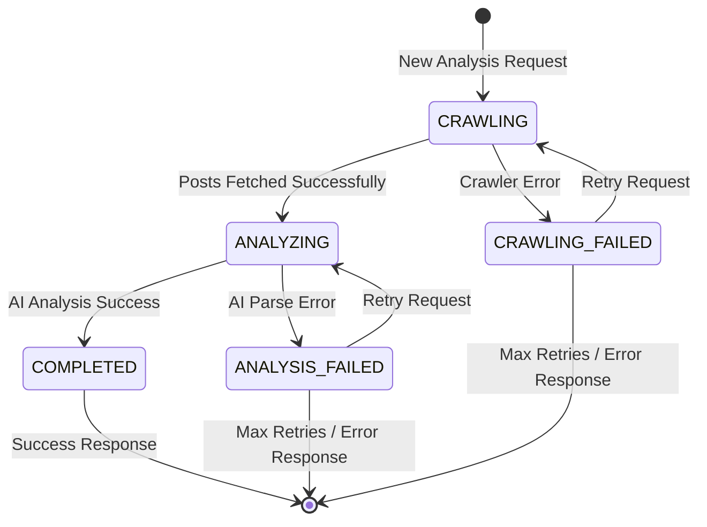

# Multi-Step Analysis with Retry Capability - Design

## Overview

This design implements a robust multi-step analysis pipeline that separates data crawling from AI analysis, enabling proper error handling and retry capabilities while maintaining the existing API interface. The system uses a state machine approach with persistent storage at each step.

## Architecture

### Database Schema Changes

#### New Posts Table
```sql
CREATE TABLE posts (
  id TEXT PRIMARY KEY DEFAULT (cuid()),
  profileUrl TEXT NOT NULL,
  platform TEXT NOT NULL,
  username TEXT NOT NULL,
  displayName TEXT,
  bio TEXT,
  verified BOOLEAN DEFAULT false,
  followerCount INTEGER,
  posts JSON NOT NULL, -- Array of post objects
  createdAt DATETIME DEFAULT CURRENT_TIMESTAMP,
  expiresAt DATETIME NOT NULL,
  
  INDEX idx_posts_profile_url (profileUrl),
  INDEX idx_posts_expires (expiresAt)
);
```

#### Updated Analysis Table
```sql
ALTER TABLE analyses ADD COLUMN postsId TEXT REFERENCES posts(id);
ALTER TABLE analyses ADD COLUMN state TEXT DEFAULT 'COMPLETED'; -- CRAWLING, ANALYZING, COMPLETED, CRAWLING_FAILED, ANALYSIS_FAILED
ALTER TABLE analyses ADD COLUMN errorMessage TEXT;
ALTER TABLE analyses ADD COLUMN retryCount INTEGER DEFAULT 0;
ALTER TABLE analyses ADD COLUMN lastRetryAt DATETIME;

CREATE INDEX idx_analyses_state ON analyses(state);
CREATE INDEX idx_analyses_profile_url_state ON analyses(profileUrl, state);
```

### State Machine Design



### Components

#### 1. AnalysisOrchestrator Service

**Purpose:** Coordinates the multi-step analysis process and manages state transitions.

**Key Methods:**
- `processAnalysisRequest(profileUrl: string): Promise<AnalysisResult>`
- `retryFailedAnalysis(analysisId: string): Promise<AnalysisResult>`
- `checkExistingAnalysis(profileUrl: string): Promise<Analysis | null>`

**Responsibilities:**
- Determine if existing analysis can be reused or needs retry
- Coordinate between crawling and AI analysis steps
- Handle state transitions and error recovery
- Manage retry logic and limits

#### 2. PostsRepository

**Purpose:** Manage storage and retrieval of crawled social media posts.

**Key Methods:**
- `findValidPostsByProfileUrl(profileUrl: string): Promise<Posts | null>`
- `createPosts(data: PostsData): Promise<Posts>`
- `isExpired(posts: Posts): boolean`

**Responsibilities:**
- Store crawled posts with expiration
- Check for existing valid posts
- Handle posts cleanup and expiration

#### 3. Enhanced AnalysisRepository

**Purpose:** Extended to support state management and retry tracking.

**New Methods:**
- `createWithState(data: AnalysisData, state: AnalysisState): Promise<Analysis>`
- `updateState(id: string, state: AnalysisState, errorMessage?: string): Promise<void>`
- `findByProfileUrlAndState(profileUrl: string, states: AnalysisState[]): Promise<Analysis[]>`
- `incrementRetryCount(id: string): Promise<void>`

#### 4. AnalysisStateMachine

**Purpose:** Encapsulate state transition logic and validation.

**Key Methods:**
- `canTransition(from: AnalysisState, to: AnalysisState): boolean`
- `getNextRetryState(currentState: AnalysisState): AnalysisState | null`
- `shouldRetry(analysis: Analysis): boolean`

## Data Flow

### 1. New Analysis Request Flow

```
1. POST /api/analysis { profileUrl }
2. AnalysisOrchestrator.processAnalysisRequest()
3. Check for existing valid completed analysis → return if found
4. Check for existing failed analysis → determine retry strategy
5. Check for existing valid posts → skip crawling if found
6. Create Analysis record in CRAWLING state
7. Execute crawling step:
   - CrawlerFactory.fetchProfile() & fetchRecentPosts()
   - Create Posts record
   - Update Analysis state to ANALYZING
8. Execute AI analysis step:
   - CredibilityAnalyzer.analyzeProfile()
   - Parse and validate AI response
   - Update Analysis state to COMPLETED or ANALYSIS_FAILED
9. Return result or error message
```

### 2. Retry Logic Flow

```
1. Same profileUrl submitted again
2. Find existing failed analysis
3. Determine retry step based on failure state:
   - CRAWLING_FAILED → restart from step 7
   - ANALYSIS_FAILED → restart from step 8 using existing posts
4. Increment retry count
5. Execute appropriate step
6. Update analysis state based on result
```

## Error Handling

### Crawling Failures
- **Network errors:** Retry with exponential backoff
- **Rate limiting:** Respect retry-after headers
- **Authentication errors:** Log and fail permanently
- **Profile not found:** Fail permanently with user-friendly message

### AI Analysis Failures
- **JSON parsing errors:** Retry with same posts
- **Model timeout:** Retry with extended timeout
- **API quota exceeded:** Fail temporarily, allow retry later
- **Invalid response format:** Log raw response, retry with different prompt

### Retry Limits
- **Maximum retries per analysis:** 3 attempts
- **Retry cooldown:** 5 minutes between attempts
- **Permanent failure threshold:** After max retries, mark as permanently failed

## API Interface (Unchanged)

### POST /api/analysis
**Request:** `{ profileUrl: string }`

**Success Response:**
```json
{
  "success": true,
  "analysisId": "analysis_id",
  "message": "Analysis started successfully",
  "analysis": {
    "id": "analysis_id",
    "profileUrl": "normalized_url",
    "platform": "twitter",
    "username": "username",
    "createdAt": "timestamp",
    "status": "started"
  }
}
```

**Error Response:**
```json
{
  "success": false,
  "error": "Analysis failed after multiple attempts. Please try again later.",
  "retryable": true
}
```

### GET /api/analysis/[id]
**Success Response:** (Same as current - full analysis results)

**Error Response:**
```json
{
  "success": false,
  "error": "Analysis is still in progress. Please try again in a few moments.",
  "status": "processing"
}
```

## Implementation Strategy

### Phase 1: Database Schema
1. Create Posts table migration
2. Add new columns to Analysis table
3. Create necessary indexes
4. Migrate existing data (mark as COMPLETED state)

### Phase 2: Core Services
1. Implement PostsRepository
2. Enhance AnalysisRepository with state management
3. Create AnalysisStateMachine utility
4. Build AnalysisOrchestrator service

### Phase 3: Integration
1. Update analysis route to use AnalysisOrchestrator
2. Modify CredibilityAnalyzer to handle parsing failures gracefully
3. Add comprehensive error logging
4. Update existing repositories to work with new schema

### Phase 4: Testing & Validation
1. Unit tests for state machine logic
2. Integration tests for retry scenarios
3. End-to-end tests with real crawler failures
4. Performance testing with concurrent requests

## Monitoring and Observability

### Key Metrics
- Analysis success/failure rates by state
- Average retry counts per analysis
- Posts reuse efficiency
- Crawler vs AI failure distribution

### Logging Strategy
- Structured logs for each state transition
- Error context preservation for debugging
- Performance metrics for each step
- Retry attempt tracking with reasons

## Security Considerations

### Data Privacy
- Posts data contains user content - ensure proper access controls
- Implement data retention policies for expired posts
- Consider GDPR implications for stored social media data

### Rate Limiting
- Prevent abuse through excessive retry requests
- Implement per-IP analysis request limits
- Monitor for suspicious retry patterns

## Performance Optimizations

### Caching Strategy
- Posts table serves as persistent cache for crawled data
- Analysis results cached as before (24 hours)
- Database indexes for efficient state and URL lookups

### Concurrent Processing
- Multiple analyses can run simultaneously
- State machine prevents race conditions
- Database transactions ensure consistency

### Resource Management
- Cleanup expired posts automatically
- Archive old failed analyses
- Monitor database growth and implement cleanup policies